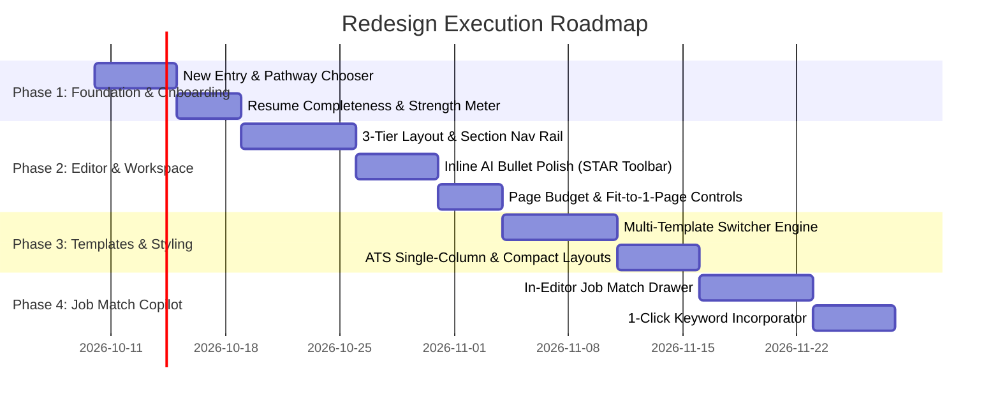

# Product & UX Redesign Specification: AI Resume Builder

**Document Version:** 1.0.0  
**Last Updated:** October 2026  
**Status:** In Review / Planning  
**Target Application:** Next.js AI Resume Builder (`cv-builder`)

---

## 1. Executive Summary & Vision

### 1.1 Objective
Transform the application from a standalone form-filling tool into an **intelligent, end-to-end Career Acceleration Workspace**. The redesign focuses on:
1. **Frictionless Onboarding & Clear Pathways:** Eliminating blank-page paralysis with role-based and goal-based entry paths.
2. **Modern 3-Tier Ergonomic Editor:** Combining section navigation, focused card editing, live A4 rendering, and an inline AI Copilot into a seamless split-screen experience.
3. **True Multi-Template Engine with Page-Budget Controls:** Introducing robust, ATS-friendly templates with dynamic spacing ("Fit-to-1-Page" algorithm) and zero print-overflow surprises.
4. **Integrated Job Match & ATS Scoring Loop:** Bringing the evaluation flow directly into the editor for instant keyword gap analysis and 1-click tailoring.
5. **Cambodian Market Leadership (Bilingual & Voice-First):** Elevating the `/basic-resume` spoken Khmer/English CV creation flow with real-time waveform feedback and frictionless Bakong KHQR coin top-ups.

---

## 2. Core User Personas & Journey Mapping

```mermaid
graph TD
    A[User Arrives on Platform] --> B{Choose Goal / Entry Point}
    
    B -->|Path 1: Has Existing PDF/DOCX| C[✨ AI Smart Ingest & Transform]
    B -->|Path 2: Building From Scratch| D[⚡ Progressive Step-by-Step Wizard]
    B -->|Path 3: First-time / Local Jobseeker| E[🎙️ Voice / Spoken Basic CV]
    B -->|Path 4: Tailoring for Specific Job| F[🎯 Job-Match Tailoring Studio]
    
    C --> G[Unified Workspace: Editor + Canvas + Copilot]
    D --> G
    E --> G
    F --> G
    
    G --> H[Live Resume Completeness & ATS Meter]
    H --> I[Template & Spacing Fine-Tuning]
    I --> J[One-Click Multi-Format Export (PDF / DOCX)]
```

### 2.1 Persona 1: "The Busy Professional" (Quick Import & Polish)
* **Goal:** Update an existing resume in minutes and make it modern.
* **Journey:**
  1. Upload PDF/DOCX file.
  2. AI parses and populates 11 standard sections in < 5 seconds.
  3. Visual side-by-side diff: original text vs. AI-enhanced bullet points (STAR method).
  4. Instant download as ATS-friendly PDF.

### 2.2 Persona 2: "The First-Time Applicant / Career Switcher" (Guided Creation)
* **Goal:** Create a strong CV without prior resume writing experience.
* **Journey:**
  1. Select target industry/role (e.g., "Junior Frontend Developer").
  2. Guided step-by-step assistant providing role-specific pre-written bullet suggestions and action verbs.
  3. Real-time **Resume Strength Meter** (0–100%) indicating missing high-impact items (e.g., "Add 1 quantifiable achievement").

### 2.3 Persona 3: "The Local Cambodian Jobseeker" (Khmer Spoken / Short-Form CV)
* **Goal:** Quick, formal Cambodian CV (ប្រវត្តិរូបសង្ខេប) without complex corporate jargon.
* **Journey:**
  1. Opens `/basic-resume` on mobile or desktop in Khmer or English.
  2. Spoken voice interview or quick-type 4-question prompt (About you, School, Work/Skills, Interests).
  3. Live preview updates as audio is transcribed and synthesized.
  4. Download formatted Khmer-friendly document ready for Telegram/Email submission.

### 2.4 Persona 4: "The Active Job Applicant" (Tailored for Job Postings)
* **Goal:** Maximize interview callbacks by optimizing for specific job descriptions.
* **Journey:**
  1. In the builder, open the "Tailor for Job" side drawer.
  2. Paste target Job Description (JD).
  3. AI displays keyword match score (e.g., 78%) and highlights missing requirements (e.g., *GraphQL*, *CI/CD*, *Agile*).
  4. 1-click apply: AI naturally embeds missing keywords into relevant experience bullets.
  5. Save as a dedicated version: `Resume_AcmeCorp.pdf`.

---

## 3. Information Architecture & Navigation

### 3.1 Global Navigation & App Shell
* **Top Header Bar:**
  * Document Title (inline editable: click to rename).
  * Auto-save status (`Saved just now` / `Syncing...` / `Offline`).
  * Coin Balance badge with 1-click top-up pill (`⚡ 25 Coins`).
  * Language Switcher (`EN` / `ខ្មែរ`).
  * Primary Actions: `✨ Tailor to Job`, `🎨 Customizer`, `📥 Export ▾` (PDF, DOCX, Share Link).

* **Collapsible Global Sidebar:**
  * **Core Tools:**
    * 📄 My Resumes (`/resumes`)
    * ✍️ Professional Builder (`/builder`)
    * 🎙️ Basic CV - Voice / Fast (`/basic-resume`)
    * 🎯 Job Description Evaluator (`/evaluation`)
  * **User & Billing:**
    * ⚡ Coins & Top-up (`/billing`)
    * ⚙️ Account Settings (`/account`)
    * 🛡️ Admin Dashboard (Admins only, `/admin`)

---

## 4. Workspace & Editor UI/UX Blueprint

### 4.1 3-Tier Split Workspace Layout

```
+-----------------------------------------------------------------------------------------------+
| [Logo] Resume: "Senior Software Engineer"   [☁️ Saved]        [⚡ 24 Coins] [Export ▾] [Share] |
+-------------------------+-----------------------------------+---------------------------------+
| 📂 SECTIONS & STRENGTH  | ✍️ FOCUSED EDITOR                 | 📄 LIVE CANVAS & COPILOT        |
|                         |                                   |                                 |
| 📊 Resume Strength: 75% | ### Work Experience               | [ Modern ▾ ] [ A4 ] [ 100% ▾ ]  |
| [========>    ]         |                                   |                                 |
| • Add 2 metrics         | 🏢 Senior Frontend Developer      | +-----------------------------+ |
|                         |    Acme Technologies (2022-Pres.) | | Jane Doe                    | |
| --- SECTIONS (Drag/Drop)|                                   | | Phnom Penh, Cambodia        | |
| ✅ Personal Info        | Responsibilities / Bullets:       | |                             | |
| ✅ Summary              | • Architected Next.js microfront- | | EXPERIENCE                  | |
| 🟡 Experience (2 items) |   ends serving 200k daily users.  | | Acme Tech - Senior Dev      | |
| ⚪ Education            |   [✨ STAR Polish] [📊 Add Metric] | | • Architected Next.js...    | |
| ⚪ Skills (4 added)     |                                   | |                             | |
| ⚪ Certifications       | + Add Responsibility Bullet       | +-----------------------------+ |
| ⚪ Volunteering         |                                   | 🎯 ATS Match: 88%               |
| + Add Custom Section    | [ + Add Work Experience ]         | Missing: "Docker", "GraphQL"  |
+-------------------------+-----------------------------------+---------------------------------+
```

### 4.2 Key Workspace Components

1. **Left Rail: Section Navigator & Real-Time Completeness Meter**
   * Visual indicator of completion per section (0–100%).
   * Drag-to-reorder sections with keyboard and touch support (`@dnd-kit`).
   * "Add Section" catalog: Publications, Languages, Certifications, References, Custom Sections.
   * Actionable checklist: *"Add at least 3 bullet points under Acme Corp"*, *"Include your LinkedIn profile"*.

2. **Center Column: Focused Card Editor**
   * Clean, card-based section containers with collapsible accordions.
   * **Inline AI Action Toolbar** on every experience/project bullet:
     * `✨ Polish & Refine`: Improves tone, grammar, and professionalism.
     * `🎯 Action-Oriented (STAR)`: Converts passive duties into Situation-Task-Action-Result format.
     * `📊 Quantify Impact`: Prompts user with placeholders for metrics (e.g., `[X]% speedup`, `[$Y] saved`).
     * `✂️ Shorten / Fit Line`: Prevents awkward 1-word line wrap on the rendered PDF.

3. **Right Column: True-to-Scale Canvas & Copilot Drawer**
   * Real-time rendering reflecting exact `@media print` dimensions.
   * **Page Overflow Boundary Markers:** Clear visual line showing where Page 1 ends and Page 2 begins.
   * **Density Controller (Fit-to-Page):**
     * Compact / Standard / Spacious presets.
     * "Auto-Fit 1 Page" toggle: automatically tunes font sizes and section padding to fit on exactly 1 page.
   * **Side-by-Side Job Match Drawer:** Collapsible tab for job description matching without leaving the editor.

---

## 5. Resume Template Engine

### 5.1 Template Catalog

| Template Name | Design Philosophy | Best For | Key Typography & Elements |
| :--- | :--- | :--- | :--- |
| **1. Modern Tech (Default)** | 2-Column with sidebar accent | Tech, Design, Startups | Inter / Geist, subtle tag badges for skills, contact icon strip |
| **2. Executive ATS** | Single-column, timeless elegance | Finance, Law, Corporate, Big Tech | Merriweather / Roboto, horizontal rule dividers, zero ATS parsing hurdles |
| **3. Compact Minimal** | Dense single/two-column hybrid | Senior Engineers, 10+ yrs Exp | Outfit / JetBrains Mono, high data density, concise tags |
| **4. Cambodian Formal** | Traditional biodata + standard order | Government, Local Banks, NGO | Kantumruy Pro / Battambang, photo frame placeholder, full biodata fields |

### 5.2 Theme Customizer System
* **Color Schemes:** Curated accessible color pairings (Navy & Slate, Emerald & Forest, Indigo & Violet, Charcoal & Amber, plus Full Hex Picker).
* **Font Pairings:** Professional curated combinations (e.g., *Inter + Roboto*, *Merriweather + Open Sans*, *Kantumruy Pro + Inter*).
* **Document Margins:** Standard (16mm), Compact (10mm), Spacious (20mm).

---

## 6. Job Description Matcher & ATS Copilot (`/evaluation` Bridge)

### 6.1 Seamless In-Editor Workflow
1. User clicks `🎯 Tailor to Job` in the builder header or right panel.
2. A sliding drawer opens allowing the user to paste a target Job Description.
3. **AI Real-Time Analysis Output:**
   * **Overall Match Score:** 0–100% gauge.
   * **Matched Keywords:** Badges with green checkmarks (e.g., `React.js`, `TypeScript`, `REST APIs`).
   * **Missing Required Skills:** Badges with 1-click action: `[+ Add to Skills]`.
   * **Experience Improvement Recommendations:** Concrete suggestions on how to rephrase current bullet points to highlight relevant qualifications.
4. **"Fork & Save as New Version":** Allows users to maintain a Master Resume while producing tailored copies per company application.

---

## 7. Cambodian Localization & Khmer UX Excellence

### 7.1 Bilingual Support & Khmer Typography
* Comprehensive i18n dictionaries for all UI text (`en.ts` and `km.ts`).
* Typography optimizations for Khmer script:
  * Enhanced line-height (`leading-relaxed` for Khmer to prevent vowel mark clipping).
  * Natural Khmer phrase-level line breaking using `word-break: keep-all; overflow-wrap: break-word`.
  * Date display options (English: `Jan 2024 – Present` / Khmer: `មករា ២០២៤ – បច្ចុប្បន្ន`).

### 7.2 Voice Interview Experience (`/basic-resume`)
* Visual audio waveform animation during active microphone input.
* Clear live status indicators: `🎙️ Listening...`, `🧠 Processing...`, `🔊 Speaking...`.
* Dual input parity: users can seamlessly switch between voice conversation and typing at any point during the interview.

### 7.3 Bakong KHQR Coin Top-Up Friction Reduction
* Transparent action pricing pills before running AI tasks (e.g., `Cost: 1 Coin • Balance: 10 Coins`).
* In-flow KHQR payment modal: generates instant Bakong QR without losing current editor state or forcing full-page redirect.
* Real-time payment verification with WebSocket / polling for instant coin crediting.

---

## 8. Phased Implementation Roadmap



### Phase 1: Onboarding & Workspace Foundations
* [ ] Implement "Choose Your Creation Pathway" onboarding modal when starting new CVs.
* [ ] Build `ResumeCompletenessMeter` component with score calculation and actionable recommendations.
* [ ] Add quick rename and live auto-save status indicators in top navigation.

### Phase 2: Editor Ergonomics & Inline AI
* [ ] Implement 3-column split view (Section List | Active Editor | Live Canvas).
* [ ] Build `InlineAiToolbar` for Experience bullet points (STAR method, Action Verbs, Metrics).
* [ ] Add visual page-break boundary guide lines in `ResumePreview`.
* [ ] Implement density presets (Compact, Normal, Spacious) and "Fit to 1 Page".

### Phase 3: Multi-Template Architecture
* [ ] Refactor template rendering system into modular components under `src/client/features/Resume/templates/`.
* [ ] Build `ExecutiveAtsTemplate` (Single-column clean format).
* [ ] Build `ModernTwoColumnTemplate` (Refined standard).
* [ ] Build `CompactTechTemplate` (High data density).
* [ ] Add real-time visual thumbnail template picker in the customizer.

### Phase 4: Integrated Job Description Copilot & Versioning
* [ ] Embed `/evaluation` logic directly into the builder as a sliding Copilot Drawer.
* [ ] Enable 1-click missing skill insertion into resume data store.
* [ ] Add "Duplicate & Tailor for Company" feature in resume management.

---

## 9. Technical Architecture & File Structure

```
src/
├── client/
│   ├── features/
│   │   ├── Editor/
│   │   │   ├── components/
│   │   │   │   ├── InlineAiToolbar.tsx          # Micro-actions for bullets (STAR, verbs)
│   │   │   │   ├── SectionNavigator.tsx         # Left rail with progress checks & drag
│   │   │   │   └── ResumeStrengthCard.tsx       # 0-100% score + improvement tasks
│   │   │   ├── ResumeEditor.tsx                 # Redesigned focused card editor
│   │   │   └── DensityControls.tsx              # Page budget & spacing slider
│   │   ├── Resume/
│   │   │   ├── templates/
│   │   │   │   ├── ModernTemplate.tsx           # Two-column tech layout
│   │   │   │   ├── ExecutiveAtsTemplate.tsx     # Single-column corporate layout
│   │   │   │   ├── CompactTemplate.tsx          # High-density tech layout
│   │   │   │   └── CambodiaFormalTemplate.tsx   # Khmer biodata format
│   │   │   ├── components/
│   │   │   │   ├── PageBreakIndicator.tsx       # Visual page boundary lines
│   │   │   │   └── TemplatePicker.tsx           # Visual thumbnail selector
│   │   │   └── ResumePreview.tsx                # Canvas wrapper with zoom & density
│   │   └── JobCopilot/
│   │       ├── JobMatchDrawer.tsx               # In-editor JD analysis sliding panel
│   │       ├── KeywordGapList.tsx               # Matched vs missing keyword chips
│   │       └── useJobCopilotLogic.ts            # JD extraction & matching logic
│   └── views/
│       └── CvBuilder/
│           ├── CvBuilder.tsx                    # 3-tier workspace assembly
│           └── useCvBuilderLogic.ts             # Workspace state & copilot coordination
```

---

*This specification serves as the design and implementation guide for upcoming sprint cycles.*
